# About AutoVuSolidity 
- is a tool to continuously mine a comprehensive vulnerable and the corresponding patched smart contract code written in Solidity and Vyper from open source projects on GitHub and from CVE records. Next, AutoVuSolidity automatically cleans and organizes the vulnerabilities and their corresponding fixes at multiple levels of granularity. After that, it automatically scans and analyzes the collected vulnerabilities and their fixes using the available smart contracts analysis tools. In addition, it automatically notifies the tool owners if the tool fails to determine the type of vulnerability or detect it, on top of reporting the vulnerabilities to developers.
- For more information,email: majdsoud5@gmail.com 

 ## Technology used 
 - Python - tkinter
 - Docker
 - Sql server
 - solc-anlyzer

 
 ## Pre-request 
 -  [Tools for Visual Studio](https://visualstudio.microsoft.com/downloads/) at least 2015
 -  [Docker](https://www.docker.com/products/docker-desktop/) 
 -  [python 3](https://www.python.org/downloads/) and Above

 ## Tools Used 

 - [Smartcheck](https://github.com/smartdec/smartcheck)
 - [solhint](https://github.com/protofire/solhin)
 - [osiris](https://github.com/christoftorres/Osiris)
 - [securify](https://github.com/eth-sri/securify2)
 - [slither](https://github.com/crytic/slither)
 - [mythril](https://github.com/ConsenSys/mythril)
 - [maian](https://github.com/ivicanikolicsg/MAIAN)
 - [honeybadger](https://github.com/christoftorres/HoneyBadger)

 # get started
 - create your own Github Access Token this [article will help you](https://catalyst.zoho.com/help/tutorials/githubbot/generate-access-token.html) 
 - create you Own [NVD API KEY](https://nvd.nist.gov/developers/request-an-api-key) 
 - activate python VE => & {path}/SolidityTool/myenv/Scripts/Activate.ps1
 - install packages => python -m pip install -U --force pip 
                       pip install -r /requirements.txt
 - creatr .env file with these variables 
    - token=(put you github Token here)
    - NVD_apk=(put you NVD key here)
     - emailPassword=(put [google app password](https://support.google.com/accounts/answer/185833) here)

    - your .env file will look like this

   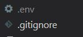

    - and your data in you env file sould look like this

    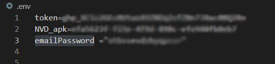

 - run main window => python mainWindow.py

    ## Database Schema 
    - this app uses SQL Server as a Docker Image, all connections and creations of database and tables related to the following schema are maintained with the app itself.
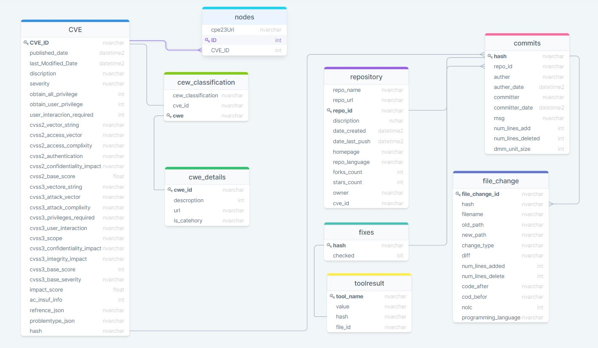

 # Screens 
 - ### Logs Window 
 Logs Window shows all installation logs for all docker tools, main SQL docker image, and connection to the database from where you can see if any error occurs while the configuration step 

 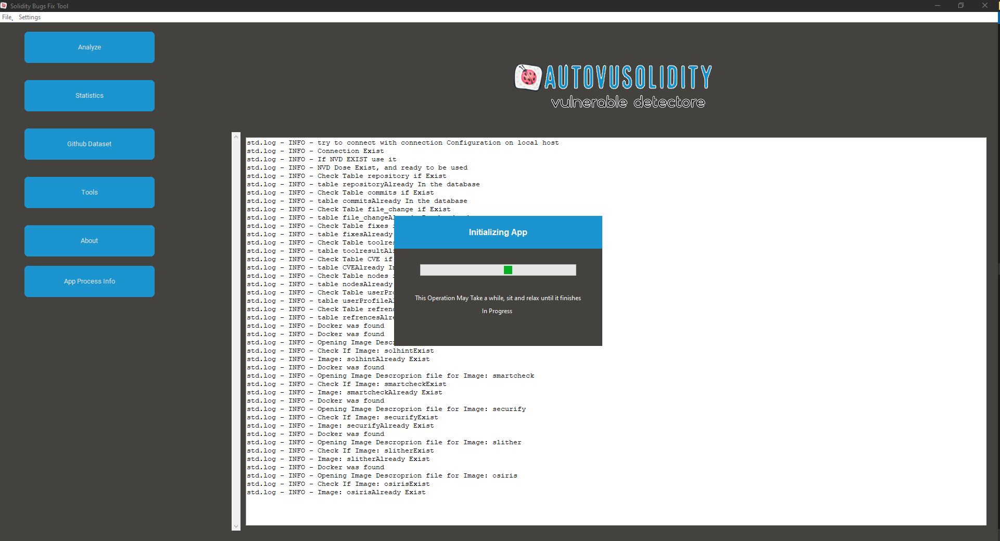

- ### Analyze Screen

  In this Screen You can Copy/Past your code and test it and get Errors in it as shown Below
  
 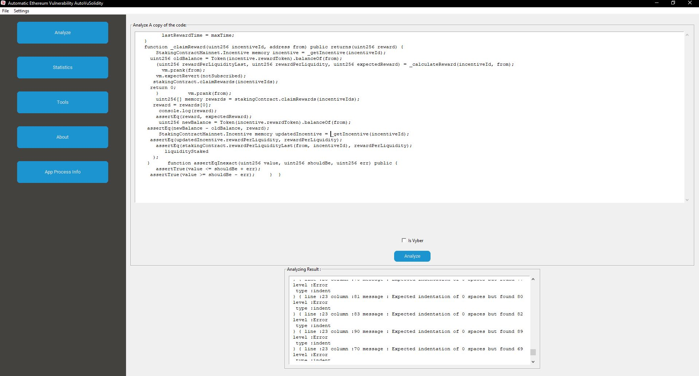

 - ### Tools 
 Small Explenation about each tool used in this App with GitGub-Repo
 
 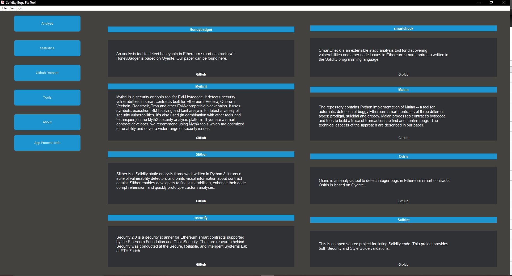

 - ### Automation
  you can find it here and also export Your data as CSV format

  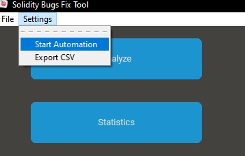    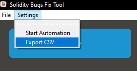  

  from here you will start your Automated Operation Of Collecting Github, CVES,and analyze them every 2 Hours, after launching the Background Process you will get a notification telling you that this is a scheduled process. 

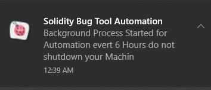

 - ### Statistics

  In this section we are showing the top 10 for the highest repos, Cves related to a certain Criteria for each table
  
 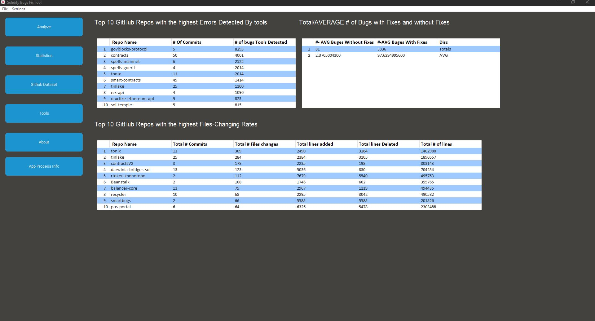

 - ### User Profile

 This screen is made to insert your Gmail Info In order to send emails to your account with the general information about your process procedure 

 
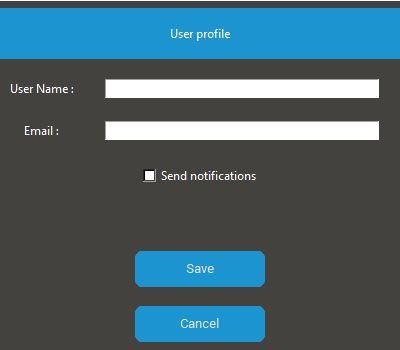

 - # Installing Process Videos 

- ### [Step 1](https://www.youtube.com/watch?v=YNZ8tdO9Aj8)

- ### [Step 2](https://www.youtube.com/watch?v=tQkMy5tBx9M)

- ### [Step 3](https://www.youtube.com/watch?v=qKIIk6eLJPY)

- ### [Step 4](https://www.youtube.com/watch?v=bwEY9tToxL8)

- ### [Step 5](https://www.youtube.com/watch?v=9EFLnBPVMCM)

- ### [Step 6](https://www.youtube.com/watch?v=SQPHuGnnH5k)

- ### [Step 7](https://www.youtube.com/watch?v=iqw0_b477d0)

- ### [Step 8](https://www.youtube.com/watch?v=qfnq-7vOzRM)

